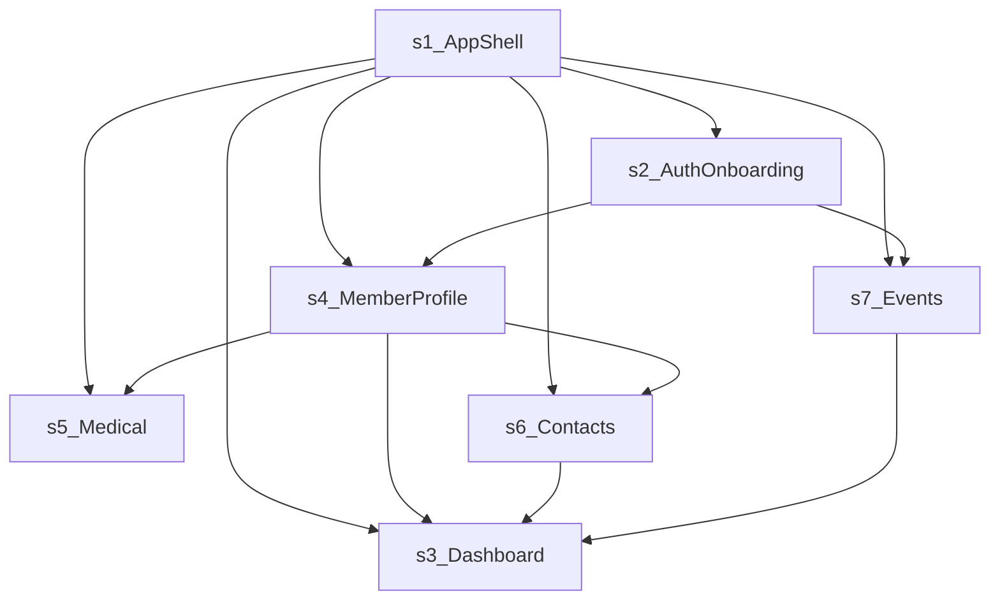

# pace-portal Architecture

## Filename convention

Portal foundation docs in this folder follow:

**`PR00-portal-architecture.md`**

| Segment | Meaning |
|--------|---------|
| **`PR`** | Requirements program prefix for this rebuild documentation set. |
| **`00`** | Foundation slot (shared with project brief and numbered requirement slices). |
| **`portal`** | Product identifier. |
| **`architecture`** | Fixed suffix for this document type. |

---

**Document type:** Single bounded-context architecture document for a `pace-core` consuming app (aligned with the pace-core architecture template: stable `§ N` headings and subsections — Overview, Acceptance criteria, API / Contract, Verification, Testing requirements, Do not, References).

**Owner:** Portal / platform team (update when ownership changes).

**Review cadence:** Quarterly, or when RBAC, routing, shared schema contracts, or app shell behavior changes materially.

**Last updated:** 2026-04-14

**Change log:** Git history for this file; record major decisions in ADRs when the team adopts them.

**Standards (01–09):** Numbered pace-suite standards — 01 Project Structure · 02 Architecture · 03 Security & RBAC · 04 API & Tech Stack · 05 pace-core Compliance · 06 Code Quality · 07 Visual · 08 Testing & Documentation · 09 Operations. Each bounded context lists only those that apply.

---

pace-portal is the member-facing PACE app for onboarding, profile management, delegated access, medical information, contacts, and event participation. This document defines the architectural foundation and bounded contexts for pace-portal as a `pace-core` consuming app.

---

## Design principles

- Use `@solvera/pace-core` for auth, RBAC, layout, and common UI primitives before introducing app-specific abstractions.
- Keep route shells and page components thin; move durable behavior into bounded hooks, services, and typed contracts.
- Treat proxy mode, public-to-authenticated handoff, and shared-schema compatibility as first-class architectural concerns.
- Split large workflows by user outcome and data seam, not by current file shape.
- Keep deferred payment functionality out of the active rebuild architecture.

---

## Cross-cutting contracts (normative summary)

These rules apply across slices; PR requirement docs reference this section instead of duplicating prose.

### RBAC and route permission model

- `setupRBAC` must run in `src/main.tsx` **before** any RBAC-dependent route renders.
- **Page permissions (active rebuild):**

| Surface | Page name | Operation |
| --- | --- | --- |
| Dashboard | `dashboard` | `read` |
| Profile completion wizard | `profile-complete` | `read` |
| Member profile | `member-profile` | `read` |
| Medical profile | `medical-profile` | `read` |
| Additional contacts | `additional-contacts` | `read` |

- **Delegated profile resource permissions:** delegated read `read:member-profiles`; delegated edit `update:member-profiles`. Delegated flows require both page-level and resource-level validation where applicable.
- **Event route `/:eventSlug/:formSlug`:** intentionally **not** wrapped in `PagePermissionGuard`; public landing is unauthenticated; authenticated behavior follows auth, profile-completion gating, proxy context, and event slices. Do not invent a page-level RBAC permission for this route unless a future requirement adds one.

### PaceAppLayout and AppSwitcher

- Authenticated `PaceAppLayout` must supply: `userFullName`, `userEmail`, `onUserMenuSignOut`, `onUserMenuChangePassword`.
- Main authenticated shell uses `PaceAppLayout`; `/profile-complete` uses `PaceAppLayout` in **navigation-free** mode (no main nav, no `AppSwitcher`).
- `AppSwitcher` from `@solvera/pace-core/components` appears **top left** in the authenticated header; populate items from apps the user can access. Omit on `/profile-complete` and public routes.

### pace-core import policy (verified entrypoints)

| Need | Import |
| --- | --- |
| Stable root APIs | `@solvera/pace-core` |
| UI components | `@solvera/pace-core/components` |
| Providers | `@solvera/pace-core/providers` |
| React hooks | `@solvera/pace-core/hooks` |
| Types | `@solvera/pace-core/types` |
| RBAC / secure Supabase | `@solvera/pace-core/rbac` |
| Login history | `@solvera/pace-core/login-history` |
| Utilities | `@solvera/pace-core/utils` |

- Zod-backed forms: prefer `useZodForm` from `@solvera/pace-core/hooks`.
- Branded IDs at boundaries: `UserId`, `OrganisationId`, `EventId`, `AppId`, `PageId` with `create*Id` / `assert*Id` at ingress.
- **Public files:** `usePublicFileDisplay` for unauthenticated public-file surfaces (e.g. event logos on public landing). Authenticated surfaces use `FileDisplay` / `useFileDisplay` and `FileUpload` / `useFileUpload`.

### Public vs authenticated file display

- **Public landing** (`EventFormLandingPage`): event logos via `usePublicFileDisplay` and `public-files` bucket—no hand-rolled storage URLs.
- **Authenticated surfaces:** `FileDisplay` or authenticated helpers—not `usePublicFileDisplay`.

---

## Route ownership and matching model

**Public routes (no session required):**

- `/login`
- `/register`
- `/:eventSlug/:formSlug` (public landing; same path later serves authenticated form when signed in—route implementation must distinguish states)

**Protected routes:**

- `/`, `/dashboard` (same dashboard surface)
- `/member-profile`
- `/medical-profile`
- `/additional-contacts`
- `/profile-complete`
- `/profile/view/:memberId`
- `/profile/edit/:memberId`

**Matching rule:** Reserved paths such as `/login`, `/register`, `/dashboard`, `/profile-complete`, and delegated profile routes must **not** be captured by the generic `/:eventSlug/:formSlug` matcher.

**Integrations (summary):** Supabase auth, tables, RPCs, storage; Google Maps Places loader; repo edge functions as present.

### Shared route `/:eventSlug/:formSlug` (product behavior)

| Condition | User-visible behavior |
| --- | --- |
| No session | Public event/form **landing** per [PR14-event-landing-handoff.md](./PR14-event-landing-handoff.md): show metadata; CTA sends the user to **sign-in** (not `/register`) while preserving event/form context for return. |
| Session present; profile or other gates apply | **Authenticated** form experience per [PR15-authenticated-form-rendering.md](./PR15-authenticated-form-rendering.md) (and wizard redirects per [PR05](./PR05-profile-wizard-shell.md) / [PR06](./PR06-wizard-field-details.md) when applicable). |
| Session present; submit | Final persistence per [PR16-event-application-submission.md](./PR16-event-application-submission.md). |

The route implementation must **branch on auth and gating state**, not assume a single page for all cases.

### Session, organisation context, and proxy (product behavior)

- **Authenticated identity** comes from the normal Supabase session; self-service routes operate on the **signed-in member** unless a slice explicitly switches to a delegated target.
- **Organisation context (pace-core):** the app **must** mount **`OrganisationServiceProvider`** from `@solvera/pace-core/providers` **inside** **`UnifiedAuthProvider`**, passing the same `supabaseClient`, `user`, and `session` the auth layer exposes (see [PR01 — Bootstrap provider order](./PR01-app-shell-routing.md#bootstrap-provider-order)). Without it, `useOrganisationsContextOptional()` is always `null`, **`selectedOrganisation` / `selectedOrganisationId` never resolve**, and org-keyed TanStack Query hooks stay **disabled** — including the profile wizard’s `fetchCurrentPersonMember(userId, organisationId)` load. That can surface as an empty shell with *“No personal profile is linked…”* even when `core_person` / `core_member` rows exist in the database.
- **Organisation context** is required where slices say writes depend on it; the UI must surface a clear error or block when org context is missing (see especially [PR16](./PR16-event-application-submission.md)).
- **Proxy / delegated access:** Target member is resolved and validated server-side; client-only hints (e.g. stored proxy mode) are **not** authorization. Delegated users follow [PR08-proxy-delegated-editing.md](./PR08-proxy-delegated-editing.md); contact duplicate rules in proxy mode evaluate against the **target member** ([PR13](./PR13-contact-create-edit-flow.md)).

### Standards numbering and Standard 07 (Visual)

- The **01–09** labels in this document follow the **renumbered pace-suite** ordering used in pace-core standards documentation. If your editor or Cursor rules show a different index, map by **standard title** (e.g. Security & RBAC, Visual), not file order alone.
- **Standard 07 (Visual)** governs global layout and presentation. Slices that cite **Standard 07** refer to that standard in the installed `@solvera/pace-core` / pace-core standards pack.
- Slices that mention **Part A** or **Part C** intend the usual subdivisions within the Visual standard document (platform CSS vs component taxonomy). If your toolchain does not expose those labels, follow **Standard 07 (Visual)** in full for UI work.

---

## Deferred domains (payments wave)

Excluded from the active rebuild architecture baseline:

- Billing profile and dashboard billing surfaces
- Stored payment methods and verification
- Public invoice payment and payment-processor integrations
- Mint-specific payment behavior and payment-processing edge functions

Reserved legacy slice IDs for a future payments wave: **POR-014, POR-015, POR-016** (no PR01–PR16 requirement files in this set).

---

## Mapping: bounded contexts to PR requirement slices

| Bounded context (this doc) | PR docs |
| --- | --- |
| § 1 App shell | [PR01-app-shell-routing.md](./PR01-app-shell-routing.md), [PR02-shared-services-hooks.md](./PR02-shared-services-hooks.md) |
| § 2 Auth / onboarding | [PR04-register-placeholder.md](./PR04-register-placeholder.md), [PR05-profile-wizard-shell.md](./PR05-profile-wizard-shell.md), [PR06-wizard-field-details.md](./PR06-wizard-field-details.md) |
| § 3 Dashboard | [PR03-dashboard-composition.md](./PR03-dashboard-composition.md) |
| § 4 Member / proxy | [PR07-member-profile-self-service.md](./PR07-member-profile-self-service.md), [PR08-proxy-delegated-editing.md](./PR08-proxy-delegated-editing.md) |
| § 5 Medical | [PR09-medical-profile-summary.md](./PR09-medical-profile-summary.md), [PR10-medical-conditions-crud.md](./PR10-medical-conditions-crud.md), [PR11-action-plan-files.md](./PR11-action-plan-files.md) |
| § 6 Contacts | [PR12-contacts-listing.md](./PR12-contacts-listing.md), [PR13-contact-create-edit-flow.md](./PR13-contact-create-edit-flow.md) |
| § 7 Events / forms | [PR14-event-landing-handoff.md](./PR14-event-landing-handoff.md), [PR15-authenticated-form-rendering.md](./PR15-authenticated-form-rendering.md), [PR16-event-application-submission.md](./PR16-event-application-submission.md) |

---

## Appendix A: Legacy slice ID mapping (POR to PR)

| Legacy ID | PR file | Short label |
| --- | --- | --- |
| POR-001 | [PR01-app-shell-routing.md](./PR01-app-shell-routing.md) | App shell routing |
| POR-002 | [PR02-shared-services-hooks.md](./PR02-shared-services-hooks.md) | Shared services hooks |
| POR-003 | [PR03-dashboard-composition.md](./PR03-dashboard-composition.md) | Dashboard composition |
| POR-004 | [PR04-register-placeholder.md](./PR04-register-placeholder.md) | Register placeholder |
| POR-005 | [PR05-profile-wizard-shell.md](./PR05-profile-wizard-shell.md) | Profile wizard shell |
| POR-006 | [PR06-wizard-field-details.md](./PR06-wizard-field-details.md) | Wizard field details |
| POR-007 | [PR07-member-profile-self-service.md](./PR07-member-profile-self-service.md) | Member profile self-service |
| POR-008 | [PR08-proxy-delegated-editing.md](./PR08-proxy-delegated-editing.md) | Proxy delegated editing |
| POR-009 | [PR09-medical-profile-summary.md](./PR09-medical-profile-summary.md) | Medical profile summary |
| POR-010 | [PR10-medical-conditions-crud.md](./PR10-medical-conditions-crud.md) | Medical conditions CRUD |
| POR-011 | [PR11-action-plan-files.md](./PR11-action-plan-files.md) | Action-plan files |
| POR-012 | [PR12-contacts-listing.md](./PR12-contacts-listing.md) | Contacts listing |
| POR-013 | [PR13-contact-create-edit-flow.md](./PR13-contact-create-edit-flow.md) | Contact create edit flow |
| POR-017 | [PR14-event-landing-handoff.md](./PR14-event-landing-handoff.md) | Event landing handoff |
| POR-018 | [PR15-authenticated-form-rendering.md](./PR15-authenticated-form-rendering.md) | Authenticated form rendering |
| POR-019 | [PR16-event-application-submission.md](./PR16-event-application-submission.md) | Event application submission |

**Suggested implementation order (dependency-first):** **PR01 → PR02 → PR03** (dashboard composition, including the `EventList` placeholder slot) → **PR04 → PR05 → PR06 → PR07 → PR09 → PR12 → PR14** (public landing + dashboard event selector **Apply / Resume / Manage**; **replaces** the PR03 placeholder and depends on PR03 being in place) → then **PR08, PR10–PR11, PR13, PR15–PR16** per each slice’s Dependencies and feature threads (PR15/PR16 after PR14 for the shared `/:eventSlug/:formSlug` authenticated flow).

---

## Appendix B: Consolidated QA review themes

The following themes from the former independent doc QA pass are **addressed in this architecture doc and PR01–PR16** (no separate review file):

- **pace-core2 entrypoints and hooks:** Centralized under [Cross-cutting contracts](#cross-cutting-contracts-normative-summary); slices use `useZodForm`, `usePublicFileDisplay` / authenticated file hooks, `SessionRestorationLoader`, `recordLogin`, and branded IDs as specified per slice.
- **PaceAppLayout and RBAC duplication:** Single normative copy in this document; slices link here instead of repeating full prop tables.
- **PR03 vs PR14:** PR03 implements the current `EventList` placeholder; PR14 replaces it with **Apply / Resume / Manage** and owns `useFileReferences` for public/dashboard event logos.
- **PR05 vs PR06:** Shell/orchestration (PR05) vs field/detail persistence (PR06) ownership is explicit in both slice docs.
- **PR10 vs PR11:** Condition modal UX (PR10) vs action-plan file lifecycle and storage rules (PR11); see **Implementation sequencing** in [PR10-medical-conditions-crud.md](./PR10-medical-conditions-crud.md) and [PR11-action-plan-files.md](./PR11-action-plan-files.md) plus each slice’s **Slice boundaries**.
- **PR13 proxy duplicate detection:** Decision table evaluates duplicates against the **target member** in proxy mode.
- **Route ownership tooling:** Human-readable route ownership was tracked in the removed `index.json`; the **route list and matching rules** above remain the architectural source of truth.

---

## Table of contents

- [§ 1 App shell and shared infrastructure](#-1-app-shell-and-shared-infrastructure)
- [§ 2 Auth, onboarding, and route handoff](#-2-auth-onboarding-and-route-handoff)
- [§ 3 Dashboard and landing composition](#-3-dashboard-and-landing-composition)
- [§ 4 Member profile and delegated access](#-4-member-profile-and-delegated-access)
- [§ 5 Medical profile and action-plan lifecycle](#-5-medical-profile-and-action-plan-lifecycle)
- [§ 6 Additional contacts and linked profiles](#-6-additional-contacts-and-linked-profiles)
- [§ 7 Events and dynamic forms](#-7-events-and-dynamic-forms)

---

## Bounded-context dependencies

Foundation: **§ 1** is the root; all other contexts depend on it. **§ 3** composes read models and entry points from **§ 4**, **§ 6**, and **§ 7**. **§ 5** depends on **§ 4** for readiness and acting context. **§ 6** depends on **§ 4** for proxy semantics. **§ 2** and **§ 7** interact for sign-in and profile completion before authenticated event flows.

---

## § 1 App shell and shared infrastructure

### Overview

- Purpose and scope: define app bootstrap, route map, top-level providers, error boundaries, shared services, and common cross-cutting hooks for the non-payment portal surfaces.
- Dependencies: none; this is the foundation for every other bounded context.
- Standards: 01, 02, 03, 04, 05, 06, 08, 09.

### Acceptance criteria

- [ ] **AC1** The shell defines a clear public vs protected route boundary for the active rebuild surfaces.
- [ ] **AC2** Global providers, auth, RBAC setup, loading states, and error boundaries are defined once at the top level.
- [ ] **AC3** Shared cross-cutting services expose stable contracts without re-embedding orchestration into feature pages.
- [ ] **AC4** Deferred payment routes and navigation do not form part of the active architecture baseline.

### API / Contract

Contract-only: public exports, paths, data touchpoints, and layout obligations — no implementation detail.

- Public exports: `APP_NAME`, root app bootstrap, route shell, error boundary, shared Supabase client, shared reference-data hooks, shared proxy/context helpers, shared profile-progress utilities.
- Public service contracts: top-level auth and RBAC setup must complete before RBAC-dependent protected surfaces render; shared services must expose typed read/write helpers rather than ad hoc page-level queries.
- File paths under the app (Standard 01): `src/main.tsx`, `src/App.tsx`, `src/lib/supabase.ts`, `src/shared/components/*`, `src/shared/hooks/*`, `src/shared/lib/*`.
- Proposed or existing tables and contracts: shared Supabase auth/session contracts, shared reference tables, and app-wide query/cache policies. This context does not own schema changes.
- `PaceAppLayout` contract: protected shells using `PaceAppLayout` must explicitly satisfy `userFullName`, `userEmail`, `onUserMenuSignOut`, and `onUserMenuChangePassword` requirements through the consuming app integration.

### Verification

- **AC1:** App boot reaches `/login`, `/dashboard`, `/profile-complete`, and `/:eventSlug/:formSlug` with the expected shell behavior; public vs protected boundaries match the active rebuild route map.
- **AC2:** Sign-in, sign-out, idle-timeout, not-found, and loading/error fallbacks can be exercised without feature-level business logic; providers and error boundaries are not duplicated on feature routes.
- **AC3:** Shared services used by multiple features are reachable without duplicating orchestration in pages (smoke: navigate across `/dashboard` and one feature route using shared hooks only at shell/shared layer).
- **AC4:** Deferred payment routes and nav are absent from the active rebuild shell and route table.

### Testing requirements

- **AC1–AC2:** Provider mounting, public/protected route gating, auth-loading behavior, reserved-route matching, shared error-boundary behavior.
- **AC3:** Shared service seams reused by multiple downstream features (contract surfaces, not page copy).
- **AC4:** Assertions or route tables that deferred payment is excluded from baseline where applicable.

### Do not

- Do not let feature pages each invent their own auth/loading/provider setup.
- Do not carry deferred payment routes or nav into the active rebuild architecture.
- Do not hide route or shared-data contracts inside oversized page components.

### References

- [Project brief: pace-portal](./PR00-portal-project-brief.md)
- `src/main.tsx`
- `src/App.tsx`
- `src/lib/supabase.ts`

---

## § 2 Auth, onboarding, and route handoff

### Overview

- Purpose and scope: define sign-in-adjacent entry points, self-service account-creation entry, the profile-completion wizard, and the handoff rules between unauthenticated event entry and authenticated downstream flows.
- Dependencies: § 1 App shell and shared infrastructure.
- Standards: 02, 03, 04, 05, 07, 08.

### Acceptance criteria

- [ ] **AC1** Public auth entry surfaces remain accessible without a signed-in session.
- [ ] **AC2** The profile-completion wizard is defined as a protected, step-based workflow with explicit redirect and validation contracts.
- [ ] **AC3** Event-driven auth handoff preserves intended redirect context without collapsing into generic registration logic.
- [ ] **AC4** Auth and onboarding requirements stay separate from downstream event submission mechanics.

### API / Contract

Contract-only: public exports, paths, data touchpoints, and layout obligations — no implementation detail.

- Public exports: registration entry page, profile-completion page, onboarding hooks, route/query-param handoff helpers, phone/address validation utilities reused by onboarding.
- Public service contracts: onboarding contracts must expose step-state, validation, prefill, persistence, and completion redirect semantics; event-auth handoff must preserve slug context and intended destination.
- File paths under the app (Standard 01): `src/pages/auth/*`, `src/hooks/auth/*`, `src/utils/auth/*`, supporting shared hooks in `src/shared/*`.
- Proposed or existing tables: member/person/contact/address tables touched by onboarding persistence, plus auth session context from Supabase.
- `PaceAppLayout` contract: the protected `/profile-complete` shell must satisfy `PaceAppLayout` authenticated-route requirements.

### Verification

- **AC1:** `/login` and `/register` (and other public auth entry routes) load and submit without an existing session.
- **AC2:** `/profile-complete` behaves as a protected, step-based flow with documented redirect and validation behavior after edits.
- **AC3:** Entry from an event URL into sign-in or onboarding returns the user to the intended downstream route; slug and redirect parameters are preserved per contract.
- **AC4:** Onboarding flows do not embed event form submission or draft/submit orchestration (those remain in § 7).

### Testing requirements

- **AC1:** Route accessibility for public auth surfaces without session.
- **AC2:** Validation gating, prefill, redirect on completion, wizard shell vs field-detail separation.
- **AC3:** Redirect preservation from event entry through auth; failure states when params are missing.
- **AC4:** Tests do not couple onboarding hooks to event submission hooks.

### Do not

- Do not reintroduce event-aware registration behavior unless a requirement explicitly restores it.
- Do not combine onboarding shell, onboarding field detail, and event form submission into one implementation unit.
- Do not bypass `pace-core` auth and protected-route patterns.

### References

- [Project brief: pace-portal](./PR00-portal-project-brief.md) (event selector and source-of-truth decisions)
- `src/pages/auth/public/RegistrationPage.tsx`
- `src/pages/auth/ProfileCompletionWizardPage.tsx`
- `src/hooks/auth/useProfileCompletionWizard.ts`
- `src/utils/auth/registrationUtils.ts`

---

## § 3 Dashboard and landing composition

### Overview

- Purpose and scope: define the protected member landing surface that composes status prompts, contacts, linked profiles, and event-entry opportunities without absorbing downstream feature implementation details.
- Dependencies: § 1 App shell and shared infrastructure; depends on bounded contracts from § 4, § 6, and § 7.
- Standards: 02, 03, 05, 07, 08.

### Acceptance criteria

- [ ] **AC1** The dashboard remains a composition surface rather than a monolithic business-logic container.
- [ ] **AC2** Dashboard cards and prompts reflect the member’s current profile, linked-profile, and event state using shared service contracts.
- [ ] **AC3** Deferred billing surfaces are excluded from the active rebuild composition.
- [ ] **AC4** Event selector redesign requirements are reflected without silently expanding into a separate product area.

### API / Contract

Contract-only: public exports, paths, data touchpoints, and layout obligations — no implementation detail.

- Public exports: dashboard page, shared landing/data-assembly hook contracts, child card composition contracts for prompts, contacts, linked profiles, and events.
- Public service contracts: the dashboard consumes bounded read models from shared hooks and downstream domains rather than directly owning all fetching/mutation logic.
- File paths under the app (Standard 01): `src/pages/DashboardPage.tsx`, `src/shared/hooks/useEnhancedLanding.ts`, supporting dashboard-facing components in `src/components/*`.
- Proposed or existing tables: none owned here directly; the dashboard consumes composed data from profile, contacts, linked-profile, and event contracts.
- `PaceAppLayout` contract: the dashboard is an authenticated route and must satisfy `PaceAppLayout` authenticated-route requirements.

### Verification

- **AC1:** `/dashboard` and `/` show composition-only behavior: cards and prompts delegate to hooks/services from § 4, § 6, § 7 without duplicating domain mutations in the page file.
- **AC2:** Changing member, linked-profile, or event state updates prompts and cards consistently with those bounded contracts.
- **AC3:** No deferred billing cards or routes appear in the active rebuild dashboard composition.
- **AC4:** Event selector and related UI stay within the documented scope (no new unmanaged product surface).

### Testing requirements

- **AC1–AC2:** Composition behavior, conditional rendering by member state, mocks for downstream hooks.
- **AC3:** Exclusion of deferred billing surfaces from dashboard tests and snapshots where applicable.
- **AC4:** Event-card rendering tests remain separate from full event submission implementation tests.

### Do not

- Do not move downstream domain logic into the dashboard simply because it is visible there.
- Do not reintroduce deferred billing cards in the active rebuild wave.
- Do not treat proxy-mode or event-state rendering as incidental edge cases.

### References

- `src/pages/DashboardPage.tsx`
- `src/shared/hooks/useEnhancedLanding.ts`
- `src/components/events/EventList.tsx`
- `src/components/contacts/LinkedProfilesSection.tsx`
- `src/components/member-profile/ProfilePrompts.tsx`

---

## § 4 Member profile and delegated access

### Overview

- Purpose and scope: define self-service member profile editing and delegated profile access flows, including proxy-mode validation, route semantics, and shared editing contracts.
- Dependencies: § 1 App shell and shared infrastructure; relies on onboarding contracts from § 2 for overlapping person/address/phone semantics.
- Standards: 02, 03, 04, 05, 07, 08.

### Acceptance criteria

- [ ] **AC1** Signed-in members can access a coherent self-service member profile flow.
- [ ] **AC2** Delegated users can access explicit proxy-mode routes and banners with the correct target-member context.
- [ ] **AC3** Address and phone handling remain explicit service seams rather than page-local incidental logic.
- [ ] **AC4** Proxy-mode behavior is documented as a first-class contract, not an unstructured edge case.

### API / Contract

Contract-only: public exports, paths, data touchpoints, and layout obligations — no implementation detail.

- Public exports: member profile page, proxy profile view/edit pages, member-profile data hooks, additional-field hooks, person and address operation hooks, proxy-mode hooks, validation utilities.
- Public service contracts: self-service and delegated flows must share compatible read/write contracts while respecting acting-user vs target-member context.
- File paths under the app (Standard 01): `src/pages/member-profile/*`, `src/hooks/member-profile/*`, `src/shared/hooks/useProxyMode.ts`, `src/utils/member-profile/*`.
- Proposed or existing tables: person, address, phone, and member-profile related shared tables and RPCs; this context does not own schema changes.
- `PaceAppLayout` contract: self-service and proxy member-profile routes are authenticated routes and must satisfy `PaceAppLayout` authenticated-route requirements.

### Verification

- **AC1:** `/member-profile` self-service edit and save flows work for a standard signed-in member.
- **AC2:** `/profile/view/:memberId` and `/profile/edit/:memberId` show proxy banners, correct target context, and guard behavior for delegated users.
- **AC3:** Address and phone changes go through documented hooks/services, not ad hoc page queries.
- **AC4:** Proxy mode is visible in routes, contracts, and tests (not only implicit branches).

### Testing requirements

- **AC1:** Self-service editing and save paths.
- **AC2:** Proxy validation failure, proxy-target success, banner and route semantics.
- **AC3:** Address/phone mutation via operation hooks; stale-context protection.
- **AC4:** Explicit tests or contract checks for proxy vs self-service.

### Do not

- Do not merge proxy-mode behavior back into a generic “edge case” branch.
- Do not hard-code address parsing, phone editing, or member-profile persistence inside page components.
- Do not widen this bounded context into contacts or medical-condition management.

### References

- `src/pages/member-profile/MemberProfilePage.tsx`
- `src/pages/member-profile/ProfileViewPage.tsx`
- `src/pages/member-profile/ProfileEditProxyPage.tsx`
- `src/hooks/member-profile/useMemberProfileData.ts`
- `src/hooks/member-profile/usePersonOperations.ts`
- `src/hooks/member-profile/useAddressOperations.ts`
- `src/shared/hooks/useProxyMode.ts`

---

## § 5 Medical profile and action-plan lifecycle

### Overview

- Purpose and scope: define the medical profile summary surface, medical-condition CRUD, and action-plan file lifecycle as related but separable capabilities.
- Dependencies: § 1 App shell and shared infrastructure; § 4 Member profile and delegated access for readiness and acting-context assumptions.
- Standards: 02, 03, 04, 05, 07, 08.

### Acceptance criteria

- [ ] **AC1** The medical profile summary, condition management, and action-plan file lifecycle are documented as distinct contracts.
- [ ] **AC2** Member-readiness and proxy-aware access behavior are explicit at the top-level medical profile surface.
- [ ] **AC3** File upload, display, replacement, and cleanup semantics are documented without hiding storage behavior inside unrelated UI code.
- [ ] **AC4** Condition-type selection fidelity is preserved unless an equal or better `pace-core` replacement exists.

### API / Contract

Contract-only: public exports, paths, data touchpoints, and layout obligations — no implementation detail.

- Public exports: medical profile page, medical summary form/display contracts, condition form contracts, medical data hooks, condition hooks, action-plan hooks, validation and Medicare-related utilities.
- Public service contracts: summary data, condition CRUD, and action-plan lifecycle must remain separable service seams with typed inputs/outputs and explicit storage/reference behavior.
- File paths under the app (Standard 01): `src/pages/medical-profile/*`, `src/components/medical-profile/*`, `src/hooks/medical-profile/*`, `src/utils/medical-profile/*`.
- Proposed or existing tables: medical profile, medical condition, action-plan, file-reference, and storage-backed contracts used by the current portal.
- `PaceAppLayout` contract: `/medical-profile` is an authenticated route and must satisfy `PaceAppLayout` authenticated-route requirements.

### Verification

- **AC1:** On `/medical-profile`, summary, conditions, and action-plan files can be exercised as separate flows per hook/service boundaries.
- **AC2:** Readiness and proxy gating match § 4 acting-context rules at entry to the surface.
- **AC3:** File operations exercise upload, display, replace, and cleanup through documented storage/reference contracts.
- **AC4:** Condition-type control meets or exceeds prior fidelity when replaced by `pace-core` components.

### Testing requirements

- **AC1:** Separate tests or suites for summary save, condition CRUD, and file lifecycle.
- **AC2:** Readiness/proxy gating tests at medical entry.
- **AC3:** Storage/reference failure, duplicate/invalid condition scenarios, cleanup on delete/replace.
- **AC4:** Regression tests for condition selector fidelity when UI changes.

### Do not

- Do not collapse summary, condition CRUD, and file lifecycle back into one undocumented page-level blob.
- Do not replace the hierarchical condition selector with a lower-fidelity control.
- Do not leave storage cleanup behavior implicit.

### References

- `src/pages/medical-profile/MedicalProfilePage.tsx`
- `src/components/medical-profile/MedicalProfile/MedicalProfileForm.tsx`
- `src/components/medical-profile/MedicalConditionForm.tsx`
- `src/hooks/medical-profile/useMedicalProfilePage.ts`
- `src/hooks/medical-profile/useMedicalConditions.ts`
- `src/hooks/medical-profile/useActionPlans.ts`

---

## § 6 Additional contacts and linked profiles

### Overview

- Purpose and scope: define additional-contact listing, create/edit/delete behavior, person matching, linked-profile behavior, and proxy-aware contact management.
- Dependencies: § 1 App shell and shared infrastructure; § 4 Member profile and delegated access for proxy-mode semantics.
- Standards: 02, 03, 04, 05, 07, 08.

### Acceptance criteria

- [ ] **AC1** Additional-contact list and create/edit flows are documented as separate but connected capabilities.
- [ ] **AC2** Existing-person matching, no-email manual contact creation, and duplicate-link protection are preserved as explicit contracts.
- [ ] **AC3** Proxy-aware contact management remains supported.
- [ ] **AC4** Linked-profile behavior is handled as a real product seam, not only incidental list data.

### API / Contract

Contract-only: public exports, paths, data touchpoints, and layout obligations — no implementation detail.

- Public exports: additional-contacts page, contact list and form contracts, linked-profile hooks, contact state hooks, contact operation hooks, contacts validation utilities.
- Public service contracts: listing, create, update, delete, match, and link flows must expose explicit contracts for acting-member context, target-member context, person matching, and duplicate handling.
- File paths under the app (Standard 01): `src/pages/contacts/*`, `src/components/contacts/*`, `src/hooks/contacts/*`, `src/utils/contacts/*`.
- Proposed or existing tables: contact, person, phone, contact-type, linked-profile, and proxy-aware RPC contracts used by the current portal.
- `PaceAppLayout` contract: `/additional-contacts` is an authenticated route and must satisfy `PaceAppLayout` authenticated-route requirements.

### Verification

- **AC1:** List vs add/edit flows on `/additional-contacts` use distinct contracts (hooks/components) that can be tested separately.
- **AC2:** Match existing person, no-email manual path, and duplicate protection behave per documented rules.
- **AC3:** Proxy context matches § 4 for contact create/edit/list.
- **AC4:** Linked profiles are exercised from dashboard and contacts entry points with explicit hooks, not only as list adornments.

### Testing requirements

- **AC1:** List vs form operation tests.
- **AC2:** Matching, no-email path, duplicate detection.
- **AC3:** Proxy failure and success paths for contacts.
- **AC4:** Linked-profile hook behavior and refresh after mutations.

### Do not

- Do not reduce the contact flow to email-only identity assumptions.
- Do not silently create duplicate person/contact links.
- Do not bury proxy-aware behavior inside untyped conditional branches.

### References

- `src/pages/contacts/AdditionalContactsPage.tsx`
- `src/components/contacts/ContactForm.tsx`
- `src/components/contacts/AdditionalContacts/AdditionalContactsList.tsx`
- `src/hooks/contacts/useAdditionalContactsData.ts`
- `src/hooks/contacts/useContactOperations.ts`
- `src/hooks/contacts/useLinkedProfiles.ts`

---

## § 7 Events and dynamic forms

### Overview

- Purpose and scope: define public event landing, sign-in handoff, dashboard event selection, authenticated dynamic form rendering, draft/resume behavior, and final event application submission.
- Dependencies: § 1 App shell and shared infrastructure; § 2 Auth, onboarding, and route handoff for sign-in/profile-completion transitions.
- Standards: 02, 03, 04, 05, 07, 08, 09.

### Acceptance criteria

- [ ] **AC1** Public event/form landing is documented separately from authenticated form rendering and final submission.
- [ ] **AC2** Event workflow state is explicit as `Apply`, `Resume`, or `Manage` using the agreed `base_application` semantics.
- [ ] **AC3** Draft/resume and final submission behavior are documented as separate contracts.
- [ ] **AC4** Event metadata, form resolution, file/logo loading, and active-form management behavior are preserved without `context_id` grouping requirements.

### API / Contract

Contract-only: public exports, paths, data touchpoints, and layout obligations — no implementation detail.

- Public exports: public event landing page, authenticated form page, form renderer, event list and manage-dialog contracts, form-loading hooks, draft-application hooks, submission hooks, file-reference hooks.
- Public service contracts: event-entry contracts must preserve slug context and public accessibility; authenticated form contracts must load existing values and draft state; submission contracts must define duplicate-safe draft-to-submitted transitions across backend tables.
- File paths under the app (Standard 01): `src/pages/events/*`, `src/components/events/*`, `src/hooks/events/*`, relevant dashboard composition hooks in `src/shared/hooks/*`.
- Proposed or existing tables: events, forms, file references, response and response-value tables, `base_application`, related RPCs, and public-file storage contracts.
- `PaceAppLayout` contract: authenticated event management and form routes must satisfy `PaceAppLayout` authenticated-route requirements whenever they render inside protected app chrome.

### Verification

- **AC1:** Public landing vs authenticated form vs submit are exercisable as separate flows (routes and hooks).
- **AC2:** `Apply`, `Resume`, and `Manage` states and `base_application` usage match the agreed semantics in UI and data.
- **AC3:** Draft persistence and resume differ from final submission in observable behavior and contracts.
- **AC4:** Forms and events resolve without relying on `context_id` grouping for the management experience in the rebuild target.

### Testing requirements

- **AC1:** Separate tests for public landing, authenticated load, and submission orchestration.
- **AC2:** State transitions and modal behavior for `Apply` / `Resume` / `Manage`.
- **AC3:** Draft persistence, resume, and submit idempotency or duplicate-safety as documented.
- **AC4:** Metadata resolution, file/logo loading, active-form management; no `context_id` dependency for management UX.

### Do not

- Do not collapse public landing, authenticated rendering, and final submission into one oversized implementation unit.
- Do not route event-entry users directly into `/register` in the rebuild target unless a requirement explicitly changes that contract.
- Do not rely on `context_id` grouping for the management experience in the current rebuild target.

### References

- [Project brief: pace-portal](./PR00-portal-project-brief.md) (event selector and source-of-truth decisions)
- [Optional pace-core2 candidates from portal slices](./PR00-portal-pace-core-candidates.md) (non-normative backlog)
- `src/pages/events/EventFormLandingPage.tsx`
- `src/pages/events/FormFillPage.tsx`
- `src/components/events/FormRenderer.tsx`
- `src/components/events/EventList.tsx`
- `src/components/events/EventManageDialog.tsx`
- `src/hooks/events/useEventFormLanding.ts`
- `src/hooks/events/useFormBySlug.ts`
- `src/hooks/events/useFormFieldData.ts`
- `src/hooks/events/useDraftApplication.ts`
- `src/hooks/events/useApplicationSubmission.ts`

---

## Prompt to use with Cursor

Implement the feature described in this document. Follow the standards and guardrails provided. Add or update tests and verification flows as specified in **Testing requirements** and **Verification**. Run the project’s quality gates (for example `npm run lint`, `npm run type-check`, and `npm run test:run` as applicable) or CI checks, and fix issues until they pass.

---

**Checklist before running Cursor:** intro doc · guardrails doc · Cursor rules · ESLint config · this architecture doc · the relevant slice requirements doc (when working on a slice).
